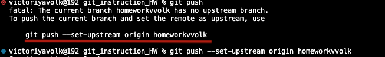

# Работа с сайтом Github

## Создание аккаунта на github.com.

Для работа на сайте github.com надо в ней  зарегитрироваться.

## Создать  репозиторий.

После успешной регистрации можно созадать репозиторий.
Дла этого нажимаем + и выбераем новый репозиторий.

Даем название репозитории.

Создаем.

## Подружить локальный и удаленный репозиторий
 
 Для синхронизации локального и удаленного репозитория нужно скопировать подсказку.

   

 Далее перенести в терминал с папкой локального репозитория

 

 # Работа с чужими репозиториями.

 ## Fork интересующего репозитория с чужого аккаунта.

 Переходим на интересующий нас аккаунт и нажимаем fork после именнуем репозиторий.

 

 Далее копируем ссылку этого репозитория.

 

 Далее открываем нужную папку в терминале и клонируем реозиторий

 

 Далее для работы с репазиторием создаем новую ветку и по ней идем.
 Так как это будет хорошим тоном.
 
 ## Отправка измений с последуюшим pull request

 После завершение работы отправляем локальный репозиторий на свой уделенный. 
командой git push --set-upstream origin mybr

 