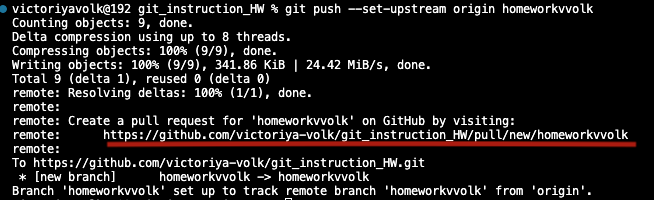

# Инструкция по работе с Git

## 1. Установка и знакомство

Для того чтобы начать работсать с Git необходимо установить его на свой компьютер с официального сайта [https://git-scm.com]().

Далее начинается работа в терминате Вашего текстового редактора, используемого лоя разработки. (Как найти терминал можно поситать в инструкции редактора.)

После открытия терминала можно проверить установлен ли Git с помощью команды

> ### git --version

Если Git установлен правильно, то после выполения команды мы увидим версию устновленного Git.

**Теперь надо познакомиться с нашим Git!**  
Для этого надо задать имя пользователя при помощи **_консольной каманды_**:

> ### git config --global user.name "<ваше_имя>"

и задать свою почту при помощи **_консольной команды_**:

> ### git config --global user.email "<адрес_почты@email.com>"

Теперь мы готовы к работе в Git.

## 2. Инициализация проекта

Для начала нам надо саздать папку и открыть ее в своем редакторе. Затем мы переходим в консоль и вводим **_команду_**:

> ### git init

Этой командой мы сообщаем Git, что надо отслеживать все изменения в открытой папке.  
Теперь можно создавать файлы, но для того чтобы все работало, нам надо выучить еще несколько **_консольных команд_**.

## 3. Несколько шагов к первому _коммиту_.

Для того, чтобы сделать первый **_коммит_** нам надо сделать некоторые инменения чтобы Git мог отследить их и записать. начнем с того, что создаем новый файл в нашей отслеживаемой папке.
А затем мы переходим в поле ввода консоли и набираем **_команду_**:

> ### git status

В появившемся сообщении в глаза бросается имя нашего файла выделеное красным шрифтом. Это сообщение о том, что изменени (создание этого файла не записано в Git).
Этим мы сейчас и займемся и для этого в **_терминате_** введем команду:

> ### git add `<file name>`

Где `<file name>` - это имя файла с разширением и **_без_** выделения кавычками или любыми скобками.
Только после добавления изменений мы можем приступить к записи или **_коммиту_** и ввести в **_терминале_** команду:

> ### git commit -m `'comment about changes'`

Где внутри '' мы можем написать комментарий к нашему **_коммиту_** чтобы в последствии ориентироваться в списке этих самых коммитов (они все создаются по этому принципу).

- Проверка статуса
- добавление (add) изменений в Git
- сохранение (commit)

после создания коммита мы можем проверить наличие этого коммита в Git при помощи команды:

> ### git log

Она выводит все коммиты в хронологическом порядке снизу (самый первый) вверх (последний).

## 4. Переход к нужному _коммиту_

После выполнения команды `git log` в терминале выводится список всех коммитов с номерами (выделенными желтым цветом), автором коммита, датой и комментарием введенными при создании.

Для того чтобы версию файла сохраненную в одном из коммитов, надо ввести команду:

> ### git checkout `<commit number>`

Где `<commit number>` - это номер комита, который выделен желтым в логах.

## 5. Возвращение к актуальному (последнему сохраненному) состоянию проекта.

Для того чтобы вернуться из вызванного коммита к актуальному состоянию проекта нужно ввести в терминале команду:

> ### git checkout master

## 5. Сравнение файла в последнем коммите с сохраненным локально.

Для сравнения последнего закомиченного состояния файла с актуальной локальной версией в терминале надо ввести команду:

> ### git diff

Отличия, если они есть, выводятся в терминале: красным - содержание удаленных строк, зеленым - содержание добавленных строк.

## 6. Добавление ветвления разработке.

Для того чтобы добавить новую ветку в разработке, нужно в терминале ввести команду:

> ### git branch `<new branch name>`

Где `<new branch name>` - это имя новой добавляемой ветки.

## 7. Проверка веток и идентификация актуальной

Для того чтобы проверить наличие веток в локальном репозитории надо ввести в терминале команду:

> ### git branch

После выполнения этой команды появится список веток и та, на которой сейчас происходит разработка она отмечена `*` и _зеленым цветом_. Вот так:

## 8. Переключение между ветками

Для того чтобы перекючиться между ветками используется команда:

> ### git checkout `<name branch>`

Где `<name branch>` - имя одной из существующих веток.

## 9. Слияние веток

Для того чтобы слить 2 ветки в одну нужно находиться на той ветке, куда мы собираемся заливать, обычно это ветка **master** и ввести в терминале команду:

> ### git merge `<name branch>`

Где `<name branch>` - это имя "заливаемой ветки".

## 10. Работа с удаленными репозиториями

Для того чтобы начать работу с удаленными репозиториями, надо создать аккаунт на GitHub.
Затем надо создать новый репозиторий и следаоать инструкциям, которые предоставляет платформа.
Для тго чтобы работать с чужим репозиторием надо открыть репозиторий на сайте GitHub и воспользоваться кнопкой Fork в правом верхнем углу.

В результате мы получим удаленный репозиторий у себя в аккаунте GitHub.
Далее надо "стянуть" или клонировать этот репозиторий воспользовавшись ссылкой со страницы репозитория и командой

> ### git clone `<link HTTPS in GitHub>`

в терминале.

Результатом этой комнды будет копия репозитория на локальном компьютере.
Далее создаем новую ветку пользуясь советами из пункта 6 настоящей иструкции и переходим на нее.
Добавив все необходимые изменения, создаем коммит (пункт 3) и вводим в терминале команду:

> ### git push

Эта команда позволяет залить изменения на даченный репозиторий.
Так как ветка создана только локально git предложит нам ее добавить и посоветует как это сделать.

После этого в терминале появится инструкция по которой мы сможем предложить создателю репозитория оценить нашу работу и слить изменения или отказаться от слияния.

Так же можно перейти в аккаунт и увидеть там :

При переходе по этим ссылкам открывается окно, в котором можно отправить свой request и добавить к нему комментарий.
