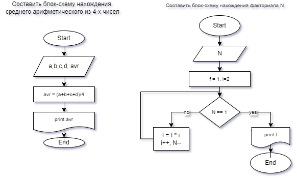

# Основные команды Git
**✦ git init**  – инициализация локального репозитория

**✦ git status** – получить информацию от git о его текущем состоянии

**✦ git add** – добавить файл или файлы к следующему коммиту

**✦ git commit** -m “message” – создание коммита.

**✦ git log** – вывод на экран истории всех коммитов с их хеш-кодами

**✦ git checkout** – переход от одного коммита к другому

**✦ git checkout master** – вернуться к актуальному состоянию и продолжить работу

**✦ git diff** – увидеть разницу между текущим файлом и закоммиченным файлом

Категорически приветствую всех на семинаре

Мы сейчас на ветке sub2 сделали ctrl+S

Делаем запись на ветке master. И  сохраняюсь.

 ## Здесь будем добавлять картинку на ветке sub3

Базовый синтаксис Markdown для внедрения изображения:

Где <alt text> — краткое описание изображения, а <folder path> — относительный путь к нему. Заменяющий текст необходим для средств чтения с экрана для слабовидящих. Он также удобен при возникновении ошибок на сайте, из-за которых не удается воспроизвести изображение.

##   Здесь добавим табличку на ветке sub4
Использование вертикальных линий и строк является самым простым способом создания таблиц в Markdown. Чтобы создать стандартную таблицу с заголовком, вставьте пунктирную линию после первой строки.

| **Это** | **просто**| **заголовок**| **таблицы**|
|:--------|------------:|--------------:|--------------:|
|иногда   |они |отображаются |неправильно|

Сохраняеся в sub4

## **Основные команды для работы с GitHub**

**✦ git clone** + вставить ссылку репозитория GitHub

**✦ git pull** - получить обновления с репозитория GitHub

**✦ git push** - отправить локальные изменения на GitHub

