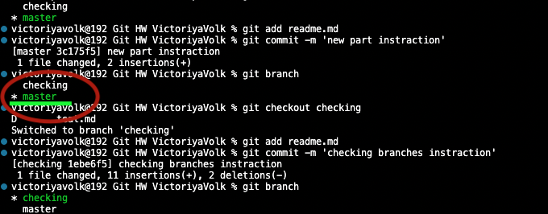

# Основные команды git

## ***Git*** - это утилита для отслеживания и ведения истории изменения файлов в вашем проекте.
****

Создадим репозиторий. Для этого пройдите в папку вашего проекта. Введите команду

**git init**

Добавим все файлы проекта в нам будующий commit

**git add .**

Если хотим добавить конкретный файл то можно так

**git add** <имя_файла>

Теперь создаем commit, чтобы создать первую точку отсчета. Обязательно указываем комментарий. И не забываем про кавычки

**git commit -m** "<комментарий>"

Вывод истории коммитов:

**git log**

Отобразить разницу между текущим сохраненным файлом и отправленным в commit:

**git diff**

Переключение между версиями:

**git checkout** <название_ветки>

Вернуться на главную ветку:

**git checkout master**

Список веток:

**git branch**

Создать ветку:

**git branch <название>**

Слить в текущую ветку из другой ветки:

**git merge <ветка>**

Клонировать и создать локально себе из внешнего репозитория:

**git clone <адрес>**

Скачать всё содержимое из внешнего репозитория и сделать merge:

**git pull**

Отправить на внешний репозиторий:

**git push**
