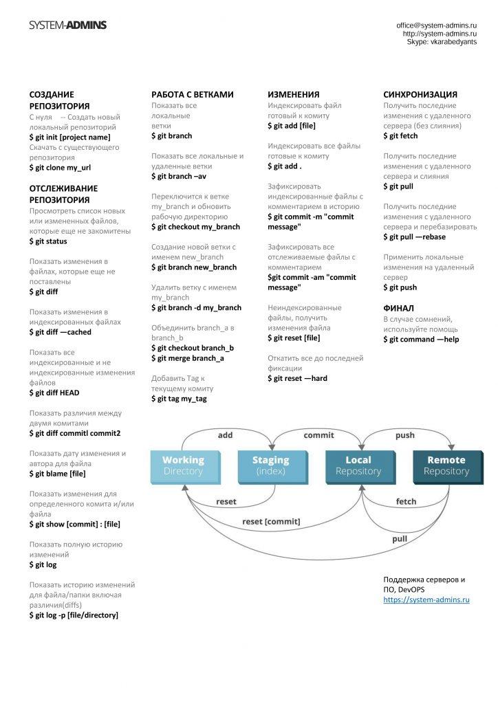

# Основные команды Git #
Введение в контроль версий. Работа с Git. Составление инструкции по работе с Git.  
**✦ git init** – *инициализация локального репозитория*  
**✦ git status** – *получить информацию от git о его текущем состоянии*  
**✦ git add** – *добавить файл или файлы к следующему коммиту*  
**✦ git commit -m “message”** – *создание коммита.*  
**✦ git log** – *вывод на экран истории всех коммитов с их хеш-кодами*  
**✦ git checkout** – *переход от одного коммита к другому*  
**✦ git checkout master** – *вернуться к актуальному состоянию и продолжить работу*  
**✦ git diff** – *увидеть разницу между текущим файлом и закоммиченным файлом*

Добавляем изображение

Изображение добавленно

Добавляем таблицу

|Это просто  | заголовок   |таблицы|
|----------|-----------|------------|
|q     |w       |e        |
|r|t   |y|

Таблица добавлена

<<<<<<< HEAD
** Конфликтная строка master **
=======
**Конфликтрая строка confBranch**
>>>>>>> confBranch

Выбираем оба варианта и коммитим.

# Третье домашнее задание #

